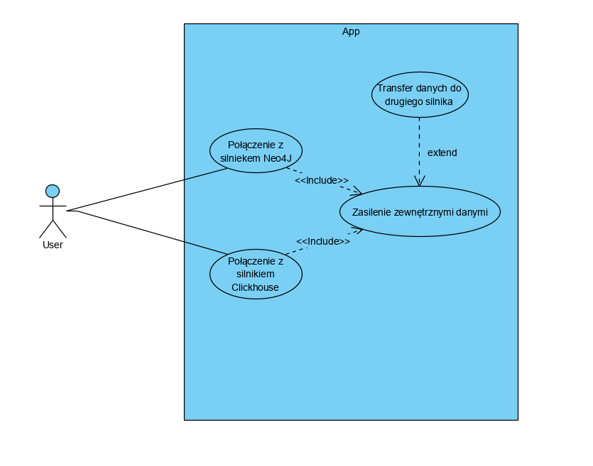
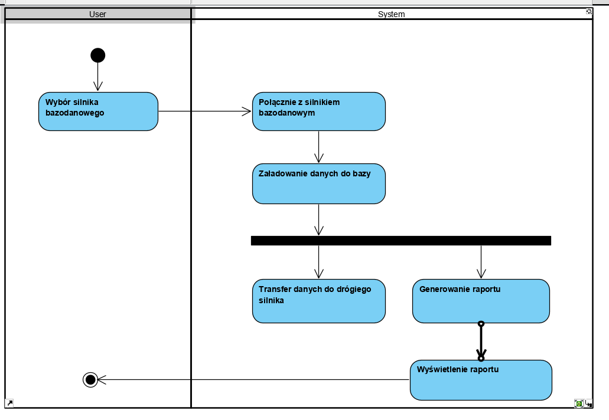
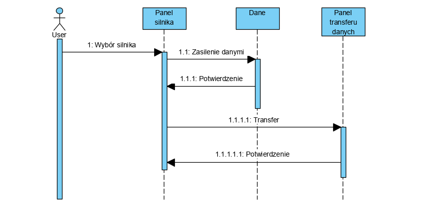
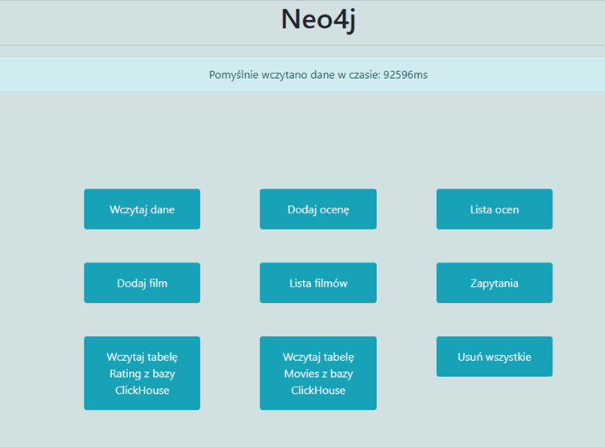
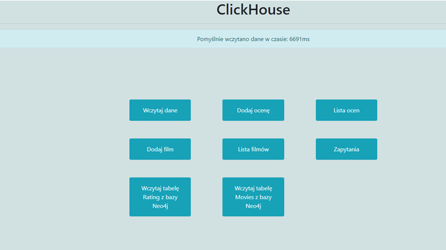

# Grupa 4
# Benchmark wydajności bazy Clickhouse oraz Neo4J
## Aplikacja benchmarkowa przygotowana na zajęcia z Inżynierskiego projektu specjalnosciowego

## Spis treści:
1. Cel systemu,
2. Potencjalni użytkownicy systemu,
3. Informacje gromadzone przez system,
4. Informacje generowane przez system,
5. Uprawnienia użytkowników,
6. Autorzy aplikacji oraz podział obowiązków,
7. Licencja,
8. Terminarz
9. Schematy UML systemu.

#### 1. Cel systemu: 
*Aplikacja pozwala na komunikacje z bazą danych Clickhouse oraz Neo4J. Użytkownik może przełączać sie pomiedzy silnikami bazodanowymi i zasilać je zewnetrznymi danymi. Po zasileniu jednego z silników użytkownik może przetransferować dane do drugiego silnika. System pozawala na wybór tabeli której zawartość wraz ze struktórą przenoszona jest między tabelami a także wykonuje proste zapytania na danych w zależności od wybranego silnika. Wszystkie operacje wykonywane w systemie generują współczynniki czasowe pozwalające na weryfikację wydajności działania danego silnika bazodanowego.*

#### 2. Potencjalni użytkownicy systemu:
*System kierowany jest do osób chcących sprawdzić wydajność silników bazodanowych przy dużej zawartości danych.*

#### 3. Informacje gromadzone przez system:
*System gromadzi informacje dotyczące czasu wykonania operacji benchmarkowych dla danego silnika*

#### 4. Informacje generowane przez system:
*Aplikacja generuje zapytania do danych w systemie. Czas wykonania zapytań jest podstawową informacją, która pozwala na weryfikacje wydajności danego silnika bazy danych.*

#### 5. Uprawnienia użytkowników:
*W systemie istnieje jedna grupa użytkowników, która ma dostęp do wszystkich funkcjonalności systemu.*

#### 6.Autorzy aplikacji oraz podział obowiązków:
- Andrzej Sabat - kapitan, pisanie kodu aplikacji
- Adam Marzec - pisanie dokumentacji, pomoc przy bazie danych
- Damian Wawrzkowicz - pisanie kodu aplikacji
- Krzysztof Pięta - zajmowanie sie bazą danych

#### 7.Licencja

Aplikacją jest objęta licencją MIT.

#### 8.Terminarz
- opracowanie założeń i wymagań do: 28.10.2019
- opracowanie wstępnej dokumentacji do: 04.11.2019
- implementacja do: 25.11.2019
- testy do: 02.12.2019
- przygotowanie dokumentacji do: 09.12.2019
- prezentacja projektu, rozliczenie, zaliczenia: 16.12.2019

#### 9. Schematy UML systemu:
- diagram przypadków użycia

 
 - diagram aktywności
 
 
 
 - diagram sekwencji

#### 10. Screeny z aplikacji:
*Wczytywanie danych*

- Neo4J

- ClickHouse

